# BÁO CÁO BÀI TẬP 

## THÔNG TIN SINH VIÊN
- **Họ và tên:** Nguyễn Minh Trí
- **Mã số sinh viên:** 24810320227
- **Lớp:** D19QTANM1
- **Tên môn học:** Lập trình.net
- **Tên bài tập:** On tap WindowFroms

----------------------------

## KẾT QUẢ THỰC HÀNH
## BAI TAP 1
### 1. Ảnh màn hình Giao diện chính
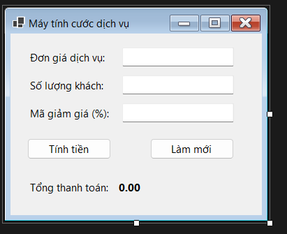
### 2. Ảnh màn hình kết quả
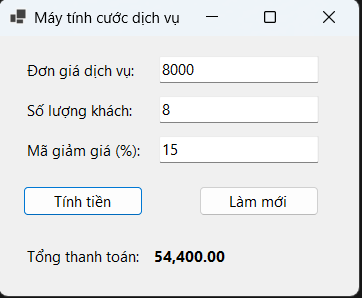
.png)
### 3. Ảnh màn hình Kiểm tra lỗi (Validation)
b1.png)

----------------------------

## BAI TAP 2
### 1. Ảnh màn hình Giao diện chính
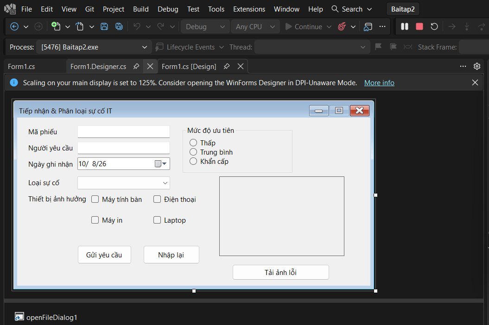
### 2. Ảnh màn hình kết quả
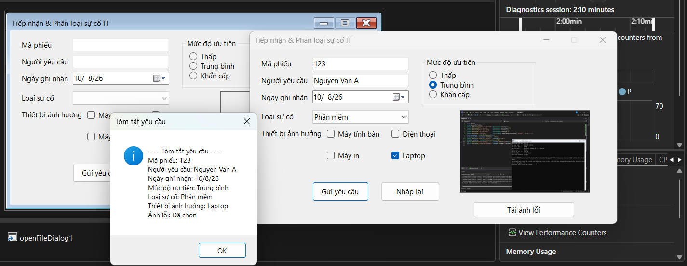
### 3. Ảnh màn hình Kiểm tra lỗi (Validation)
b2.png)

----------------------------

## BAI TAP 3
### 1. Ảnh màn hình Giao diện chính
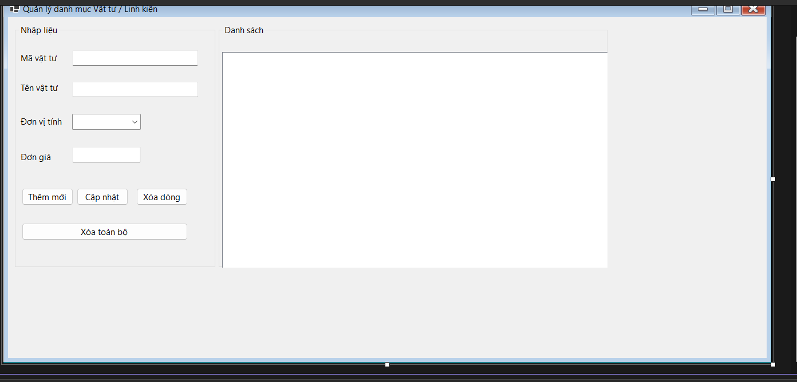
### 2. Ảnh màn hình kết quả
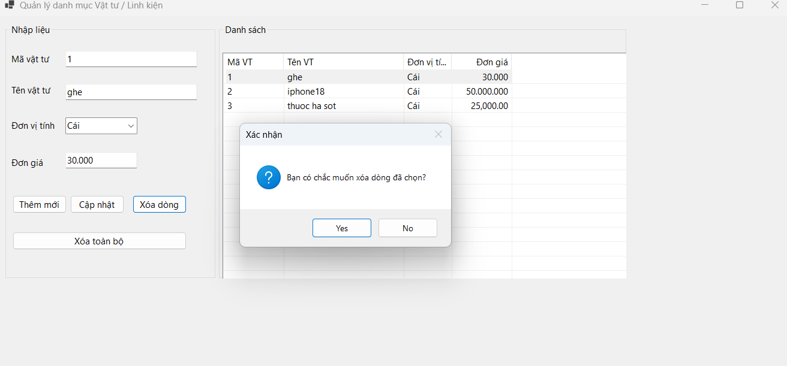
.png)
.png)
### 3. Ảnh màn hình Kiểm tra lỗi (Validation)
b2.png)

----------------------------

## BAI TAP 4
### 1. Ảnh màn hình Giao diện chính
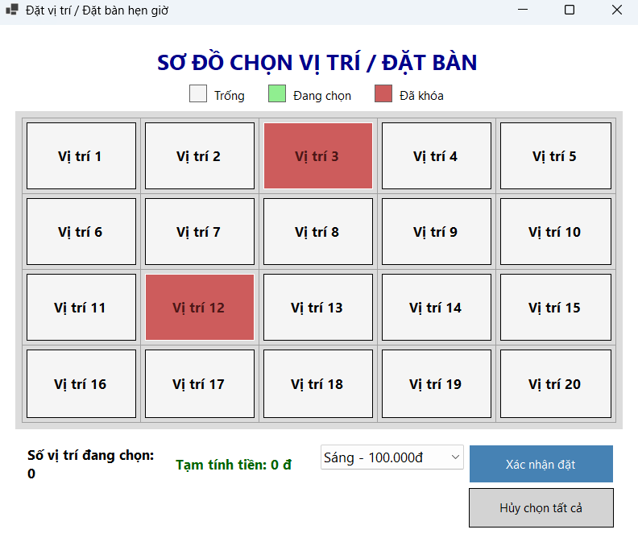
### 2. Ảnh màn hình kết quả
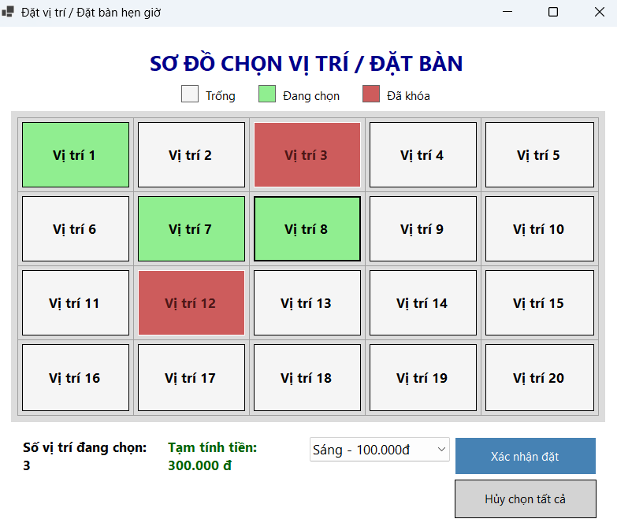
.png)
.png)
### 3. Ảnh màn hình Kiểm tra lỗi (Validation)
b2.png)

----------------------------

## BAI TAP 5
### 1. Ảnh màn hình Giao diện chính
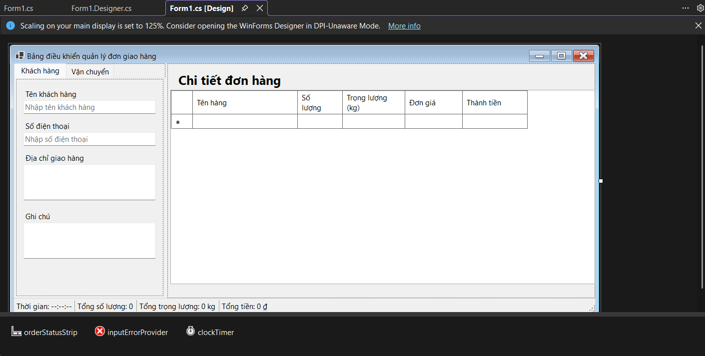
### 2. Ảnh màn hình kết quả
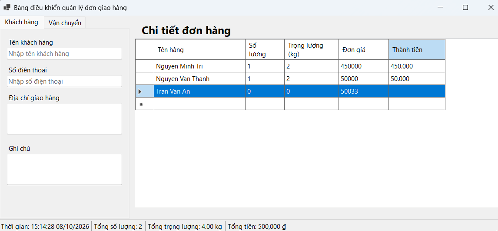
.png)
### 3. Ảnh màn hình Kiểm tra lỗi (Validation)
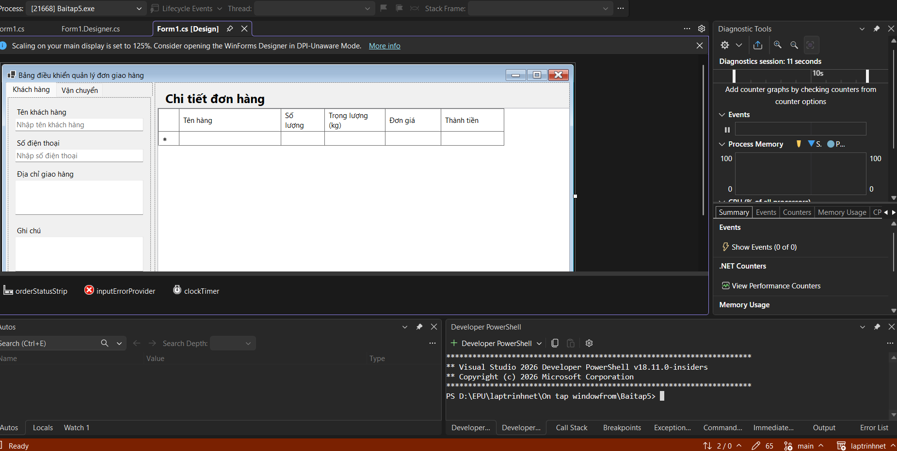