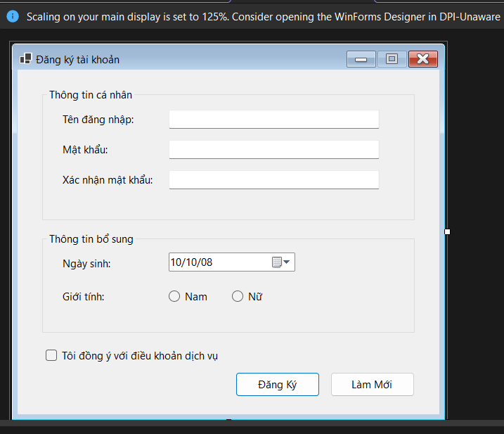
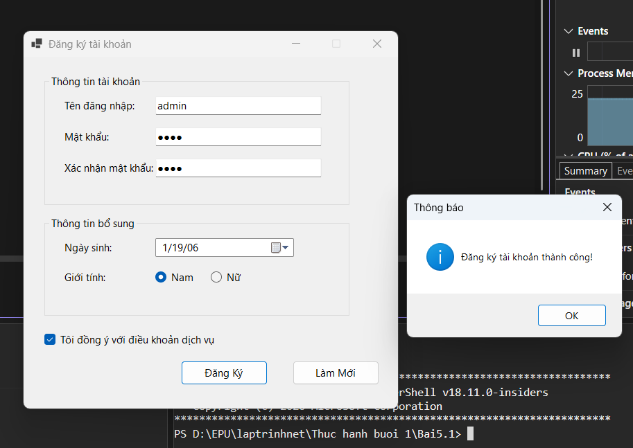
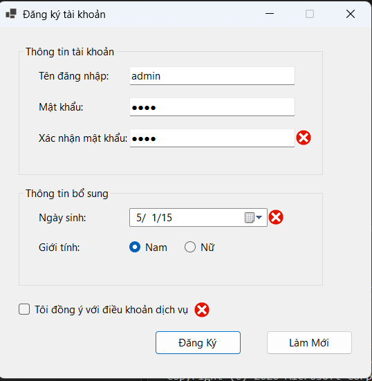
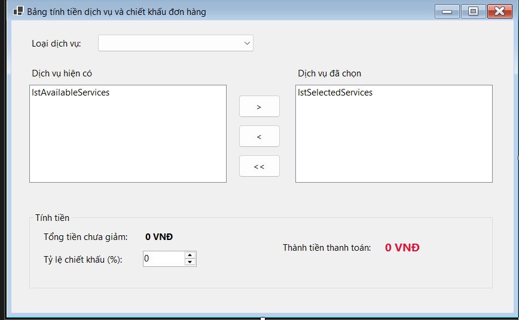
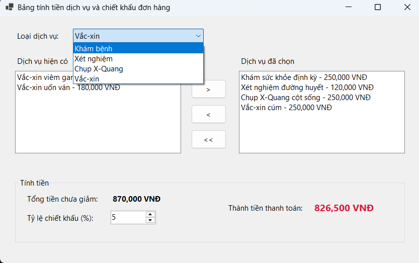
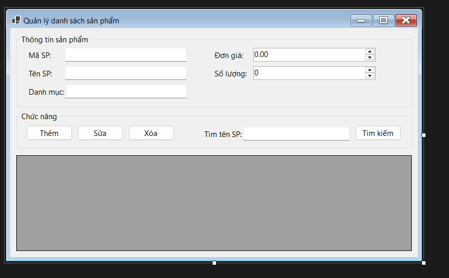
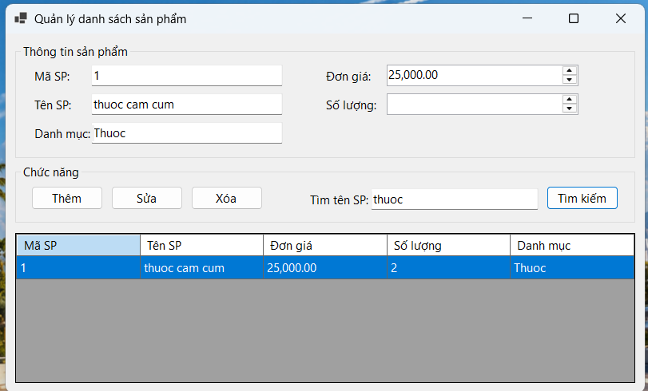
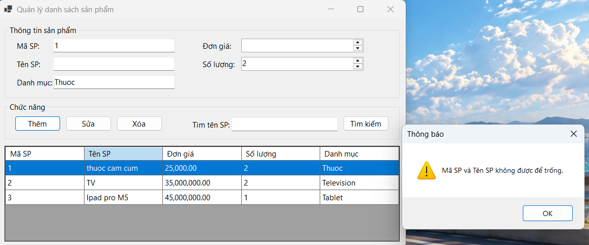
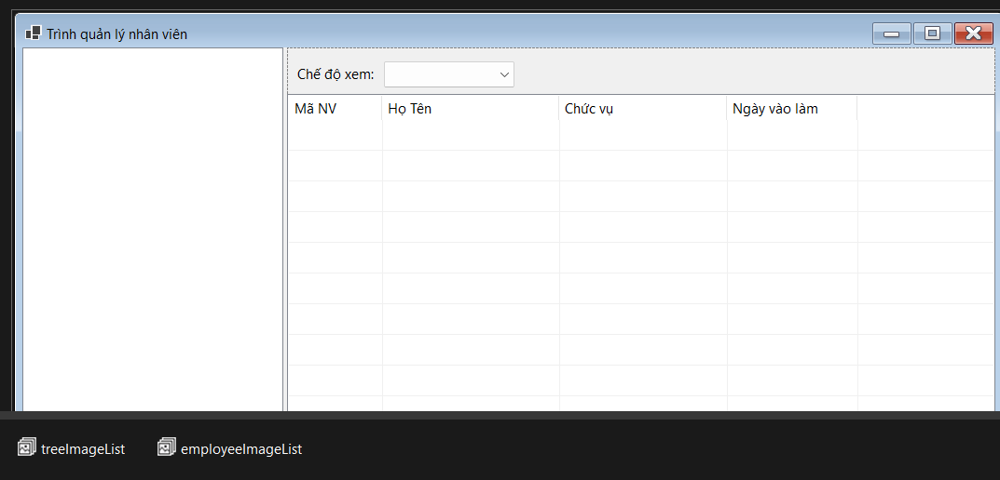
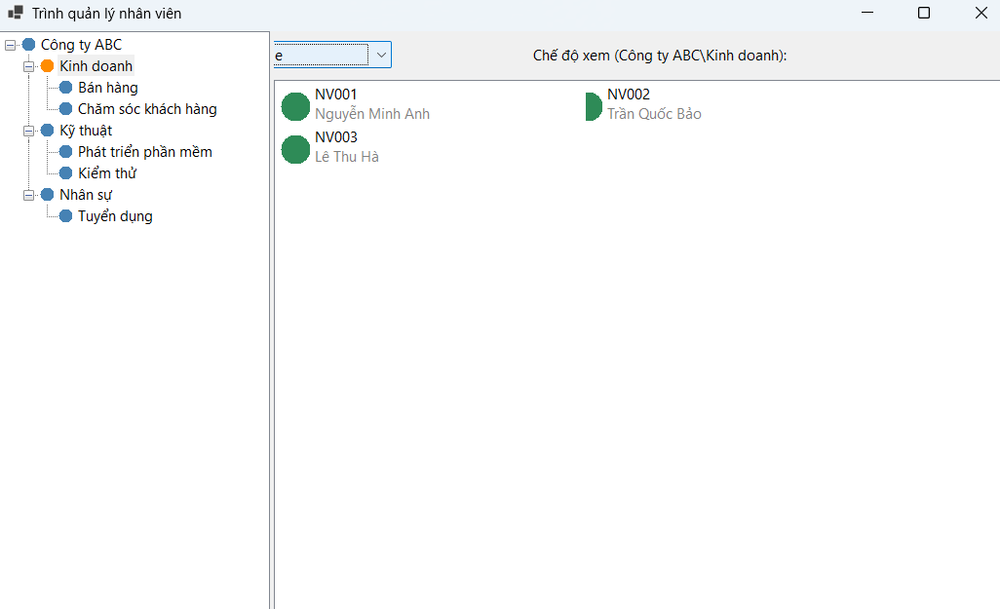

# BÁO CÁO BÀI TẬP THỰC HÀNH NGÀY 10/10/2026

## THÔNG TIN SINH VIÊN
- **Họ và tên:** Nguyễn Minh Trí
- **Mã số sinh viên:** 24810320227
- **Lớp:** D19QTANM1
- **Tên môn học:** Lập trình.net
- **Tên bài tập:** Bài thực hành 5.1 đến bài 5.4

----------------------------

## KẾT QUẢ THỰC HÀNH
## BAI TAP 5.1
### 1. Ảnh màn hình Giao diện chính

### 2. Ảnh màn hình kết quả

### 3. Ảnh màn hình Kiểm tra lỗi (Validation)

----------------------------

## KẾT QUẢ THỰC HÀNH
## BAI TAP 5.2
### 1. Ảnh màn hình Giao diện chính

### 2. Ảnh màn hình kết quả
.png)

----------------------------

## KẾT QUẢ THỰC HÀNH
## BAI TAP 5.3
### 1. Ảnh màn hình Giao diện chính

### 2. Ảnh màn hình kết quả

.png)
### 3. Ảnh màn hình Kiểm tra lỗi (Validation)

----------------------------

----------------------------

## KẾT QUẢ THỰC HÀNH
## BAI TAP 5.4
### 1. Ảnh màn hình Giao diện chính

### 2. Ảnh màn hình kết quả
.png)
.png)
.png)

----------------------------

